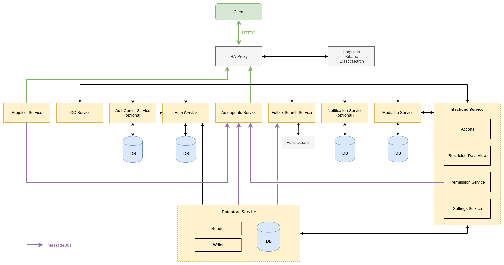

# OpenSlides

## What is OpenSlides?

OpenSlides is a free, web based presentation and assembly system for
managing and projecting agenda, motions and elections of an assembly. See
https://openslides.com for more information.

__Note: OpenSlides 4 is currently under development.__

## Architecture of OpenSlides 4

Read more about our [concept of OpenSlides 4.0](https://github.com/OpenSlides/OpenSlides/wiki/DE%3A-Konzept-OpenSlides-4).

## Installation

### Requirements

You need [Docker](https://docs.docker.com/engine/install/) and [Docker
Compose](https://docs.docker.com/compose/install/).

### Setup OpenSlides

Go to a nice place in your filesystem and get the [OpenSlides manage
tool](https://github.com/OpenSlides/openslides-manage-service/releases/tag/latest).

Create configuration files:

    $ ./manage setup --cwd  # TODO: Provide instruction using XDG_DATA_PATH.

Build and start Docker containers. According to your Docker installation you may
have to run this as root:

    $ docker-compose up --detach

Setup initial-data:

    $ ./manage initial-data

Now you can open http://localhost:8000 and use OpenSlides.

To stop OpenSlides run:

    $ docker-compose stop

To remove all containers including the complete database run:

    $ docker-compose rm

## Installation with ...

TODO: Provide a short instruction for setup with Docker Swarm or Kubernetes or
something else.

## Development setup

For a development setup, refer to [the development docs](DEVELOPMENT.md)

## Used software

OpenSlides uses the following projects or parts of them:

* Several Python packages (see TODO)
* Several JavaScript packages (see TODO)
* TODO

## License and authors

OpenSlides is Free/Libre Open Source Software (FLOSS), and distributed
under the MIT License, see ``LICENSE`` file. The authors of OpenSlides are
mentioned in the ``AUTHORS`` file.
