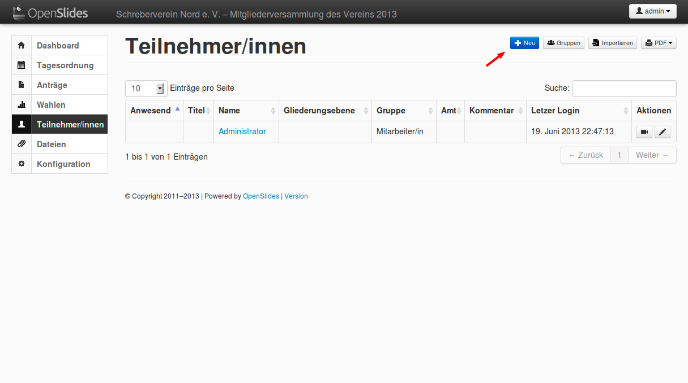
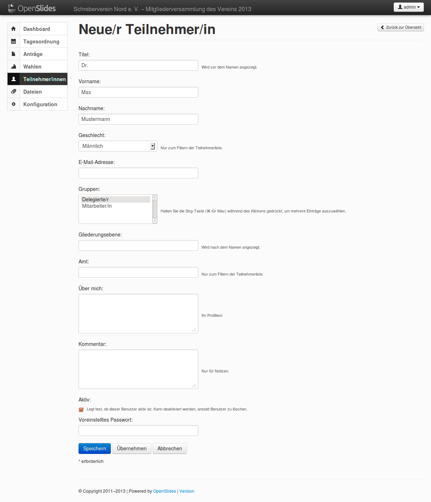
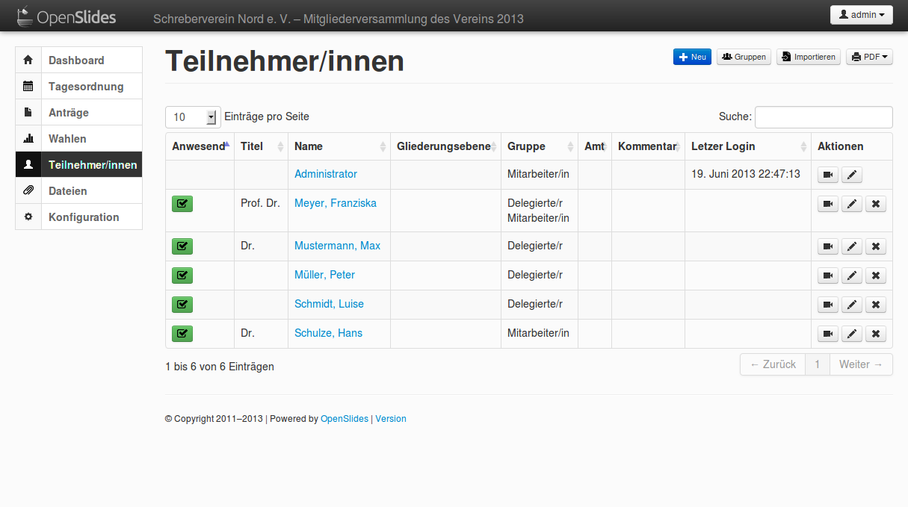
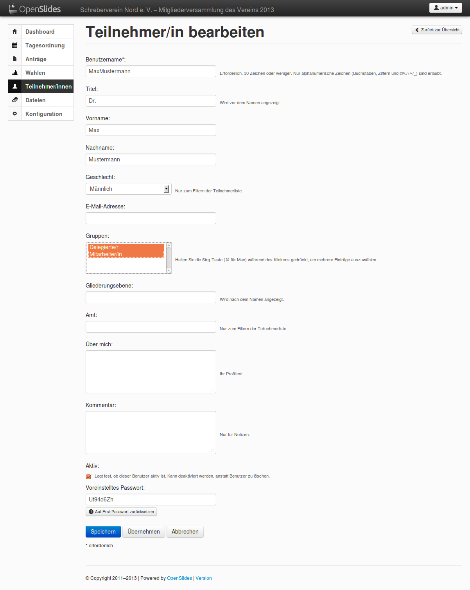
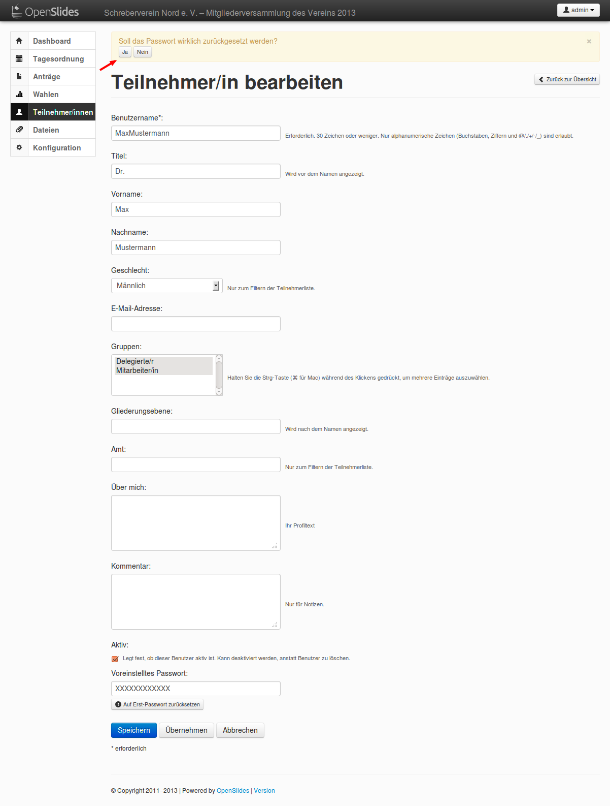

Teilnehmer/innen verwalten
==========================

In diesem Teil lernen Sie, wie Sie die Teilnehmer und Teilnehmerinnen Ihrer
Veranstaltungen im System erfassen. Im Präsentationsmodus brauchen Sie grundsätzlich nur
diejenigen Teilnehmer und Teilnehmerinnen erfassen, die das System
verwalten, Anträge stellen oder unterstützen, auf Redelisten stehen oder bei Wahlen kandidieren.

Eingabe der Teilnehmer und Teilnehmerinnen
------------------------------------------

Sie können die Teilnehmer und Teilnehmerinnen einzeln eintragen oder, wie im
Kapitel Einzelne Funktionen, Abschnitt `Teilnehmer/innen`__ beschrieben,
importieren. Jedoch werden beim Import alle vorher eingetragenen Teilnehmer
gelöscht. Eingetragenen Personen, die das System verwalten sollen, müssen
die entsprechenden Berechtigungen zugewiesen werden.

.. __: Participant.html

Wechseln Sie zum Menüpunkt „Teilnehmer/innen“. Klicken Sie oben rechts auf
„Neu“

und geben Sie einen neuen Teilnehmer wie folgt ein:

Titel:
  Dr.

Vorname:
  Max

Nachname:
  Mustermann

Geschlecht:
  männlich

Gruppen:
  Delegierter

Wiederholen Sie diese Schritte und geben Sie folgende weitere Teilnehmer
und Teilnehmerinnen ein: Peter Müller, Prof. Dr. Franziska Meyer, Luise Schmidt und Dr. Hans Schulze.

Wenn Sie auf der Übersichtsseite „Teilnehmer/innen“ sind,
sehen Sie die folgende Übersicht:

Bearbeiten eines Teilnehmers
----------------------------

Sie können die Angaben zu einem Teilnehmer jederzeit bearbeiten. Klicken
Sie zum Beispiel beim Teilnehmer „Max Mustermann“ unter der Rubrik
„Aktionen“ auf das Bearbeiten-Symbol |edit| und weisen Sie der Person die
Gruppen „Delegierter“ und „Mitarbeiter“ zu. Um mehrere
Einträge auszuwählen, halten Sie beim Anklicken die Taste ``Strg`` gedrückt.

Passworts eines Teilnehmers
---------------------------

Beim Anlegen eines Teilnehmers wird automatisch ein zufälliges
Erst-Passwort gesetzt. Sie können das Erst-Passwort aus einer PDF-Datei
ablesen, die Sie durch Klick auf den Link „Erst-Passwörter als PDF“ im
rechten oberen Menü erreichen.

Bitten Sie jeden, dem Sie sein Erst-Passwort aushändigen, dieses nach dem
ersten Login zu ändern.

Um als Administrator das Passwort von zum Beispiel Max Mustermann neu zu
setzen, klicken Sie erneut auf das Bearbeiten-Symbol |edit| und tragen Sie
unten unter „Voreingestelltes Passwort“ ein neues, selbstgewähltes Passwort
ein. Anschließend klicken Sie auf ``Übernehmen``. In einem zweiten Schritt
müssen Sie auf den Link ``Auf Erst-Passwort zurücksetzen`` klicken, um das im
System gespeicherte Passwort mit Ihrem neu eingegebenen zu ersetzen.
Bestätigen Sie den oben auf der Seite erscheinenden Dialog mit ``Ja``.

Weiter geht es mit dem vierten Teil des Tutorials: `Anträge verwalten und
behandeln`__

.. __: Tutorial_4.html
