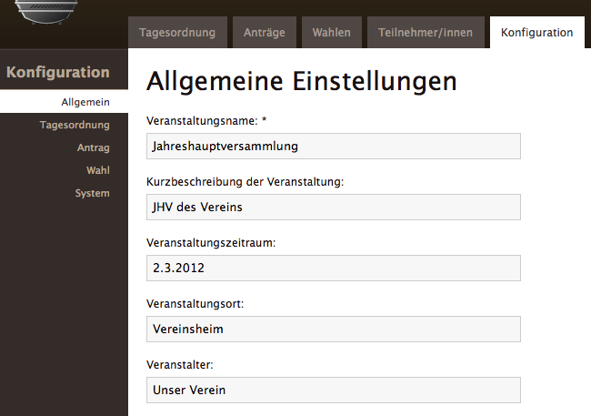
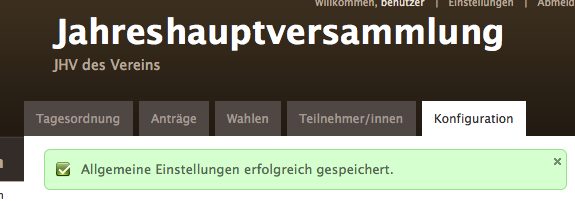
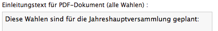
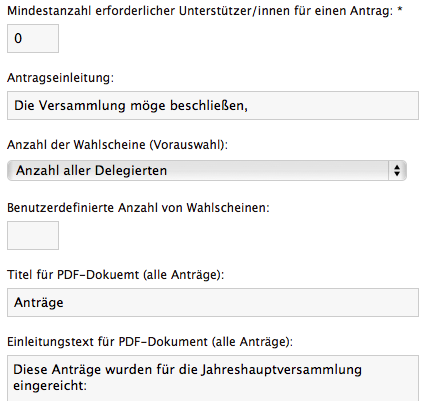
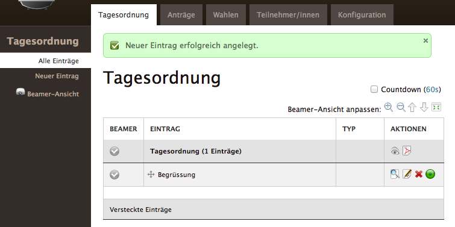
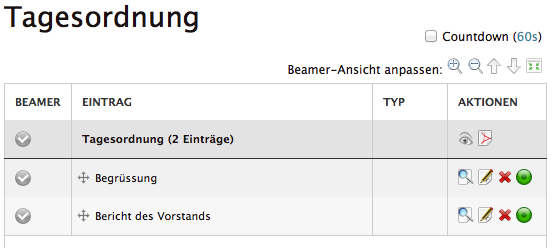
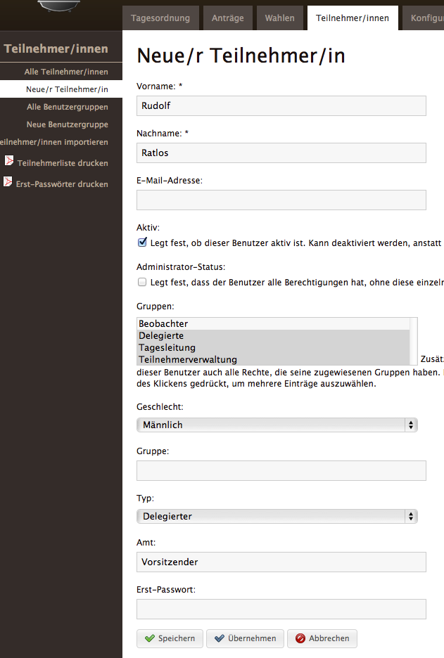

Openslides in 30 Minuten
========================

In dieser Kurzanleitung (Tutorial) lernen Sie die grundlegenden Eigenschaften von Openslides kennen, indem Sie eine Veranstaltung in Kurzform erstellen.

An allen Stellen wo offensichtlich später z.B. der Name Ihres Vereins/Ihrer Partei etc. verwendet wird können Sie gerne sofort Ihre eigenen Daten verwenden, allerdings unterscheiden sich dann später aber Bildschirmkopien von Ihrer aktuellen Umgebung.

Voraussetzungen
---------------
Es wird vorausgesetzt dass Openslides auf einem Rechner bereits lokal in Betrieb genommen wurde und Sie mit einer frischen (leeren) Datenbank starten (http://openslides.org/download/INSTALL-1.1.txt). Sie müssen wissen für welchen Port (TODO: Indexeintrag) Openslides bei der Installation konfiguriert wurde, um das Programm starten zu können.

Wir gehen zunächst davon aus, dass Sie der Installationsanleitung gefolgt sind und der Port "8000" ist. Als weitere Grundlage gehen wir davon aus, dass ein Benutzer "benutzer" mit dem Passwort "openslides" und Mail "benutzer@mail.de" beim Erstellen der Datenbank angelegt wurde. Überall wo diese Daten eingegeben werden müssen, sollten Sie den evtl. den von Ihnen anders benannten Benutzer bzw. Passwort verwenden.

Desweiteren sollten Sie einen Web-Browser (Firefox, Safari, Internet Explorer o.ä.) zum Zugriff auf Webseiten zur Verfügung haben.

Zusammenstellen der Veranstaltung
---------------------------------

Starten Sie mit der Eingabe "http://localhost:8000" im Web-Browser und bestätigen Sie mit "Enter".

Es wird automatisch die Seite "http://localhost:8000/login/" angezeigt:

.. image:: _static/images/login.png

Geben Sie "benutzer" als Nutzername und "openslides" als Passwort ein (bzw. Ihre anders gewählten Daten) und klicken Sie "Anmelden".

Sie sehen nun den Startbildschirm. Oben rechts wird der angemeldete Benutzer angezeigt.

.. image:: _static/images/init_start.png

Klicken Sie auf die obere Lasche "Konfiguration"

.. image:: _static/images/config_tab.png

und geben Sie die Daten wie angezeigt ein:

danach klicken Sie "Speichern".

Solche Bestätigungen werden häufiger im Browser eingeblendet! Die gespeicherten Daten werden in der Überschrift angezeigt.

Klicken Sie nun auf die linke Lasche "Wahl" (oben ist noch "Konfiguration" gewählt).

.. image:: _static/images/config_tab_election.png

Schreiben Sie den Einleitungstext in das vorgesehene Feld und klicken Sie "Speichern".

Auch hier erhalten Sie eine Bestätigung des Vorgangs.

Wählen Sie nun "Antrag":

.. image:: _static/images/config_tab_application.png

und geben Sie "Mindestanzahl..."  0 ein sowie den Einleitungstext:

Hiermit ist die Konfiguration zunächst abgeschlossen.

Klicken Sie nun auf "Tagesordnung" um diese anzuzeigen. Die Liste ist zunächst leer und wir legen mit "Neuer Eintrag" einen neuen Tagesordnungspunkt an: (TODO: Bild falsch)

.. image:: _static/images/top_new.png

Klicken Sie "Speichern" und schauen Sie bitte auf die nun erscheinende List:

Geben Sie einen weitere Tagesordnungspunkt "Bericht des Vorstands" ein:

Klicken Sie nun auf die Lasche "Teilnehmer/innen"

.. image:: _static/images/participants_tab.png

Um Anträge anlegen und Wahlen veranstalten zu können werden Sie nun Teilnehmer anlegen. Hierzu wählen Sie "Neue/r Teilnehmer/in" aus, so dass das Eingabefomular für Teilnehmer erscheint. Erfassen Sie nun 3 Teilnehmer. Zunächst Rudolf Ratlos wie dargestellt, die Einstellung für die Gruppen können Sie wie im Erläuterungstext beschrieben mehrfach markieren.

und klicken Sie "Speichern". In der Liste sehen Sie nun einen Eintrag für Rudolf Ratlos.

.. image:: _static/images/participant_added.png

Klicken Sie auf das "Bearbeiten" Symbol am Ende der Zeile (Papier mit Stift). Sie sehen, dass dem Teilnehmer ein weiteres Feld "Benutzername" mit dem automatisch generierten Benutzernamen zugefügt wurde und im Feld "Erst-Passwort" (unten) etwas kryptisches eingetragen wurde.
(TODO: Benutzernamen und passwort ändern???). Klicken Se einfach erneut "Speichern".

Legen Sie nun Thea Tatendrang und Werner Wichtig genauso an wie eben, nur dass als Gruppe lediglich "Delegierte", das korrekte Geschlecht und kein Amt eingetragen wird. Die Liste sieht dann wie folgt aus:

.. image:: _static/images/participant_all_added_list.png

Durchführen der Veranstaltung
-----------------------------
Alle notwendigen Daten wurden im vorigen Abschnitt erfasst. In dieser Kurzanleitung wird die Veranstaltung als eine Art "Präsentation" durchgeführt, d.h. es gibt einen Rechner im Raum, ein Anwesender bedient diesen und alle anderen Anwesenden können den Ablauf auf einer Leinwand (Beamer erforderlich) verfolgen.

Es wird davon ausgegangen, dass der Erstbenutzer "benutzer" mit dem Passwort "openslides" angemeldet ist und die Ansicht zeigt die Tagesordnung.

Starten Sie ein weiteres Browser-Fenster und geben Sie dort ebenfalls "http://localhost:8000" ein. Sie landen ebenfalls auf der Tagesordnung. Dort wählen Sie nun links "Beamer-Ansicht". (Platzieren Sie dieses Browser-Fenster so, dass es vom Beamer dargestellt wird. Das zweite Fenster mit der Tagesordnung verbleibt auf dem "alternativen" Bildschirm und stellt das Arbeitsfenster dar. Eventuell muss am Computer oder am Beamer etwas eingestellt werden, damit 2 verschiedene Bildschirme verwaltet werden können. Dies zu beschreiben geht über den Horizont der Kurzanleitung hinaus.)

Im Beamer-Fenster ist folgendes sichtbar (Ausschnitt):

.. image:: _static/images/beamer_view_top_part.png

Die Beamer-Ansicht wird über die Tagesordnung gesteuert und aktualisiert sich innerhalb kurzer Zeit nach einer Änderung. Ohne Ihr Zutun wird die vollständige Tagesordnung dargestellt.

Klicken Sie nun in der Tagesordnung auf den Haken links neben "Begrüssung" und beachten Sie das Beamer-Fenster. Dort wird jetzt fett "Begrüssung" angezeigt und die Anwesenden können den Fortschritt der Sitzung verfolgen.

Bereinigung der Daten
---------------------

Nachdem Sie diese Kurzanleitung mit Testdaten durchgespielt haben sollten Sie die Datenbank neu erstellen/löschen. (TODO: löschen???)
